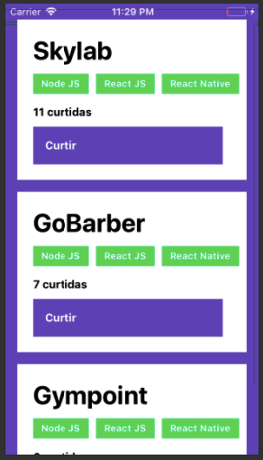

<h1 align="center">
    
</h1>

<h3 align="center">
  Desafio sobre Conceitos de React Native aplicado no Bootcamp GoStack
</h3>

<p align="center">
  <a href="#rocket-sobre-a-aplicação">Sobre a Aplicação</a>&nbsp;&nbsp;&nbsp;|&nbsp;&nbsp;&nbsp;
  <a href="#conteúdo-abordado">Conteúdo Abordado</a>&nbsp;&nbsp;&nbsp;|&nbsp;&nbsp;&nbsp;
  <a href="#instalação">Instalação</a>&nbsp;&nbsp;&nbsp;|&nbsp;&nbsp;&nbsp;
  <a href="#executando-a-aplicação">Executando a Aplicação</a>&nbsp;&nbsp;&nbsp;|&nbsp;&nbsp;&nbsp;
  <a href="#executando-os-testes-da-aplicação">Executando os Testes da Aplicação</a>&nbsp;&nbsp;&nbsp;|&nbsp;&nbsp;&nbsp;
  <a href="#tela-da-aplicação">Tela da Aplicação</a>&nbsp;&nbsp;&nbsp;|&nbsp;&nbsp;&nbsp;
  <a href="#memo-licença">Licença</a>
</p>

## :rocket: Sobre a Aplicação

Essa é o aplicativo da aplicação para armazenar repositórios do seu portfólio, que irá permitir a listagem e dar likes nos repositórios que mais gostar.

## Conteúdo Abordado

- Arquitetura React Native;
- Configurando SDK;
- Criando novo projeto;
- Diferenças do ReactJS;
- Listando projetos da API;
- Criando novos projetos.

## Instalação

Instalação das dependências do projeto.

```sh
# Com NPM
npm install

# Com Yarn
yarn
```

## Executando a Aplicação

```sh
# Executar no Emulador do iOS
cd ios && pod install && cd ..
react-native run-ios

# Executar no Emulador do Android
react-native run-android
```

## Executando os Testes da Aplicação

```sh
# Com NPM
npm run test

# Com Yarn
yarn test
```

## Tela da Aplicação



## :memo: Licença

Esse projeto está sob a licença MIT. Veja o arquivo [LICENSE](LICENSE.md) para mais detalhes.
